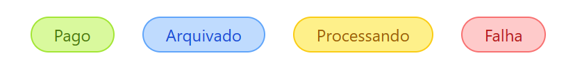
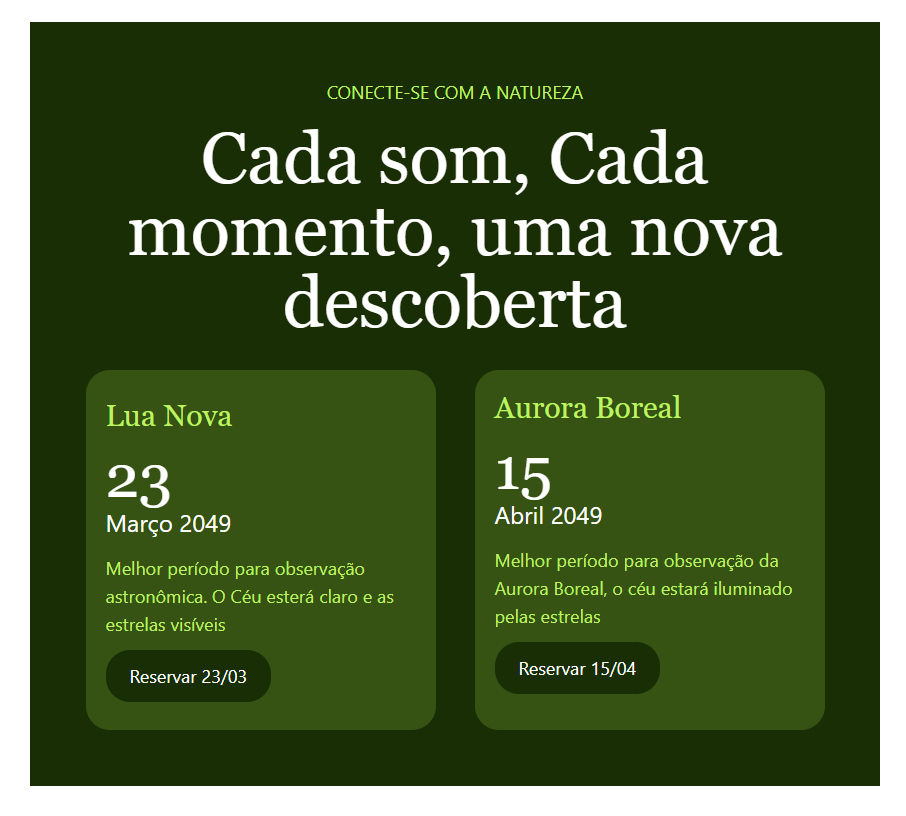

# 🧪 Tailwind CSS - Mini Projetos

Este repositório contém mini projetos desenvolvidos com **HTML**, **CSS** e **Tailwind CSS**, com o objetivo de praticar e dominar os principais conceitos e utilidades dessa poderosa framework de estilização.

### ✅ Tecnologias Utilizadas

- **HTML5**
- **CSS3**
- **Tailwind CSS** (sem frameworks JS ou bundlers como React/Vite)

## 🚀 Projetos

### 📦 `box-model`

Projeto criado para explorar e entender o comportamento do **Box Model** com Tailwind. Nele foram aplicadas diversas classes utilitárias para estudar:

- `height` e `width`
- `padding` e `margin`
- `background-color`
- `border`
- `font-size`, `text-color` e `spacing`

---

### 🧱 `grid-gap`

Projeto simples feito para praticar o uso de **grid layout** e a propriedade `gap` no Tailwind. Foi explorado:

- `grid-cols`
- `gap`, `gap-x`, `gap-y`
- Alinhamentos e distribuição de colunas

---

### 🎨 `cores`

Projeto focado no estudo das **paletas de cores** do Tailwind CSS. A proposta foi criar uma página com blocos coloridos utilizando:

- Classes de `background-color`
- `hover`, `opacity`, `border-color`
- Cores personalizadas e padrão do Tailwind

---

### 🌿 `conecte-se-com-a-natureza`

Página inspiracional com foco em **tipografia**, **espaçamento** e **cores suaves**. Projeto que simula uma landing page simples com o tema natureza, utilizando:

- `font-family`, `font-size`, `leading`
- `spacing`, `padding`, `margin`
- `text-lime-...`, `rounded`

